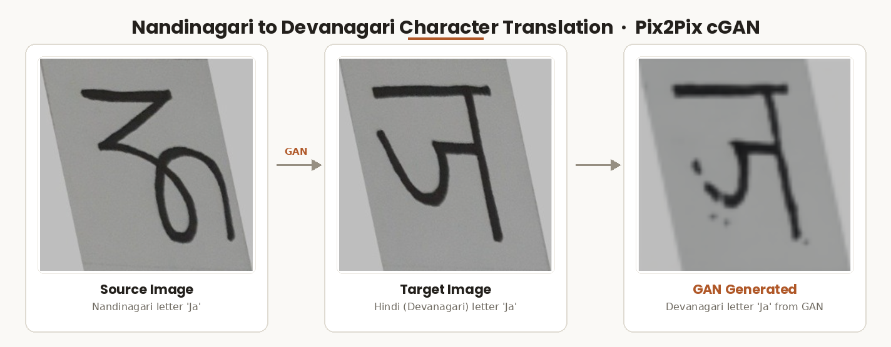
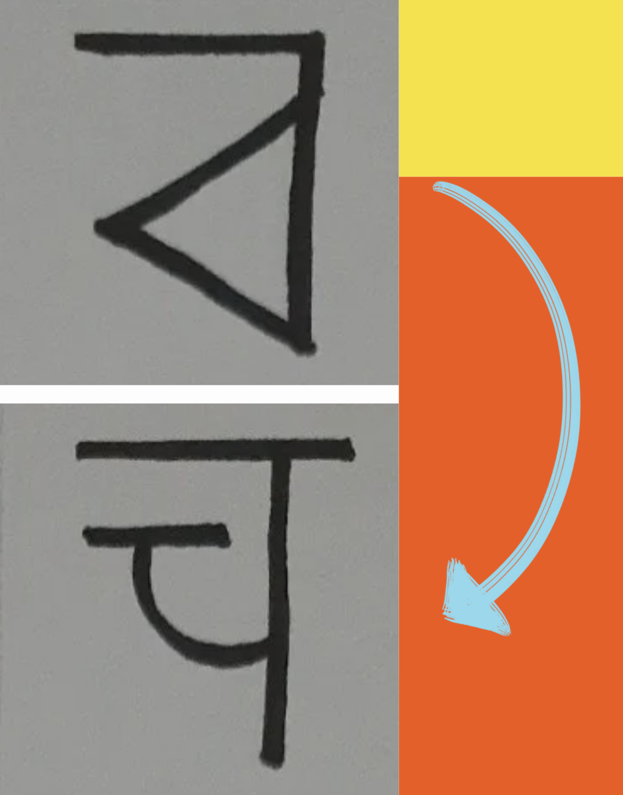
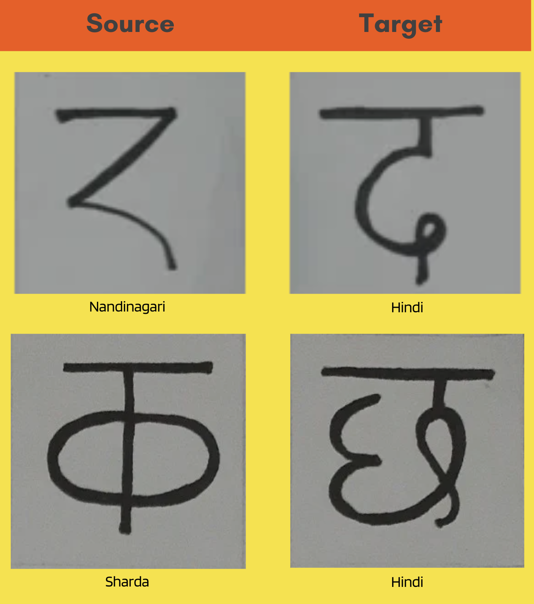
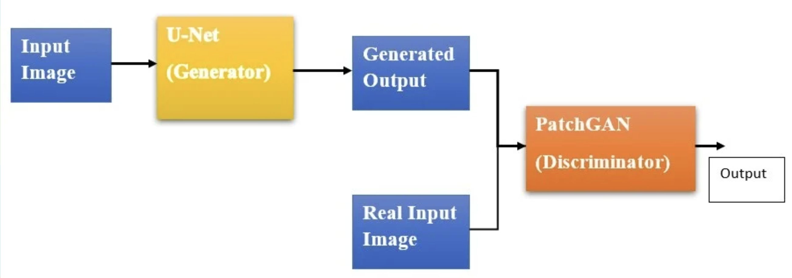
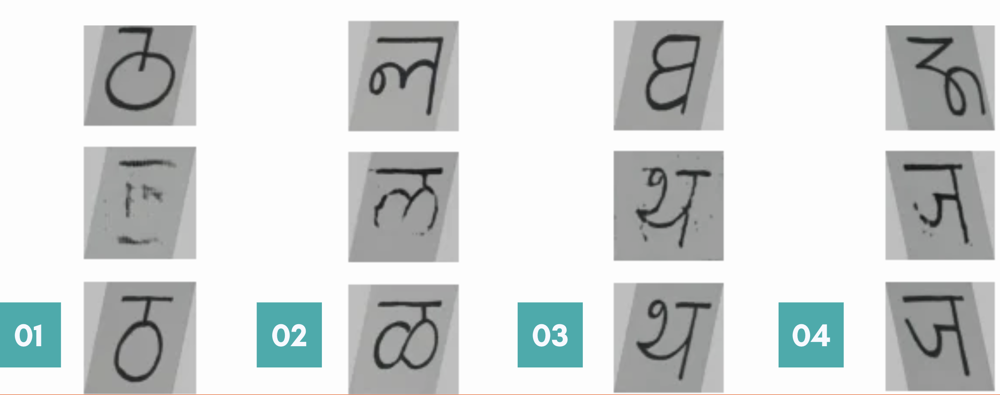
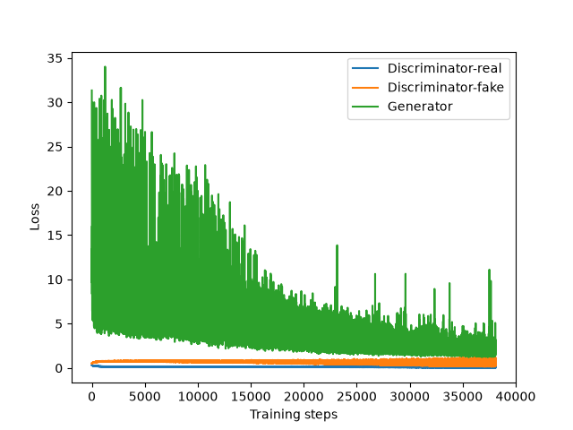

# Character Translation using GAN
### Image-to-Image Translation of Ancient Indian Scripts (Nandinagari & Sharda) to Hindi

<!-- 🖼️ IMAGE 1: Add a banner/cover image here. 
     Use the brain/circuit graphic from Slide 1 (title slide) of PROJECT_PRESENTATION.pdf, 
     OR better — create a simple collage of one Nandinagari, one Sharda, and one Hindi 
     character side by side as a hero banner. Save as assets/banner.png -->


---

### 📽️ [View the Full Project Presentation](https://canva.link/ng1hggrgn62574m)
*For a complete visual walkthrough of the problem, dataset, architecture, and results.*

---

## 📌 Overview

This project performs **image-to-image translation** of handwritten characters from two historic Indian scripts — **Nandinagari** and **Sharda** — into their equivalent **Hindi (Devanagari)** characters, using a **Pix2Pix Conditional Generative Adversarial Network (cGAN)**.

Nandinagari and Sharda are scripts once used in various parts of India (Sharda primarily in the Kashmir region, Nandinagari in southern India) that appear in historical manuscripts and inscriptions but are unreadable to most people today. This project explores whether a GAN can learn to "translate" character images from these scripts directly into Hindi, without requiring an intermediate text-recognition or transliteration step.

## 🎯 Problem Statement & Motivation

<!-- 🖼️ IMAGE 2: Use the Nandinagari/Sharda sample character images from Slide 2 
     ("Problem Statement") of PROJECT_PRESENTATION.pdf — the two character crops 
     with the blue arrow. Save as assets/problem_statement.png -->


Many historical documents, inscriptions, and copper-plate records exist only as **images**, not as digitized or transliterated text. This creates a few challenges this project tries to address:

- **Unavailability of data in text format** — most historical records in these scripts are locked in image form.
- **Direct translation from digital images** (e.g., copper plate inscriptions) is largely unexplored.
- **Historical significance** — preserving accessibility to India's linguistic history.
- **Accessibility for the general public** — enabling people unfamiliar with Nandinagari/Sharda to understand these texts without needing a linguist.

## 🗂️ Dataset

<!-- 🖼️ IMAGE 3: Use the Source/Target grid from Slide 4 ("DATASET") of 
     PROJECT_PRESENTATION.pdf — the 4-image grid showing Nandinagari→Hindi 
     and Sharda→Hindi pairs. Save as assets/dataset_samples.png -->


The dataset is **handmade** — each character was handwritten and photographed to create paired (source, target) images.

| Script | Pairs |
|---|---|
| Nandinagari → Hindi | 315 |
| Sharda → Hindi | 66 |
| **Total** | **381** |

Images are stored as:
- `Source Images/` — handwritten Nandinagari and Sharda characters
- `Target Images/` — corresponding Hindi character equivalents

Each pair is preprocessed (resized, normalized to `[-1, 1]`) before being fed into the model.

## 🧠 Approach: Pix2Pix Conditional GAN

<!-- 🖼️ IMAGE 4: Use the GAN composition diagram from Slide 5 ("Generative Adversarial 
     Networks") of PROJECT_PRESENTATION.pdf. Save as assets/gan_overview.png -->

Standard GANs generate data from random noise and offer no control over *what* gets generated. Since this task requires **targeted, paired translation** (a specific Nandinagari/Sharda character → a specific Hindi character), a **Conditional GAN (Pix2Pix)** was used instead.

Pix2Pix (Isola et al.) is designed for general-purpose image-to-image translation and consists of:

- **Generator: U-Net** — an encoder-decoder architecture with skip connections that preserves spatial structure while translating style.
- **Discriminator: PatchGAN** — classifies whether overlapping local patches of the generated image are real or fake, rather than judging the whole image at once.

<!-- 🖼️ IMAGE 5: Use the U-Net architecture diagram from Slide 7 of 
     PROJECT_PRESENTATION.pdf. Save as assets/unet_architecture.png -->
<!--  -->

<!-- 🖼️ IMAGE 6: Use the full Pix2Pix pipeline diagram (Input → U-Net Generator → 
     Generated Output → PatchGAN Discriminator → Output) from Slides 6/8-11 of 
     PROJECT_PRESENTATION.pdf. Pick the clearest/most complete version, e.g. Slide 11. 
     Save as assets/pix2pix_pipeline.png -->
<p align="center">
  
</p>

The model is trained adversarially: the generator tries to produce Hindi character images convincing enough to fool the discriminator, while the discriminator learns to tell real Hindi characters apart from generated ones — conditioned on the source character image in both cases.

## ⚙️ Setup

### Requirements

```bash
pip install -r requirements.txt
```

Key dependencies:
- `tensorflow`
- `opencv-python`
- `numpy`, `matplotlib`
- `scikit-image` (for SSIM/PSNR evaluation metrics)

## 🚀 Usage

1. Clone the repo:
   ```bash
   git clone https://github.com/Vaibhavi-29/Character-Translation-using-GAN.git
   cd Character-Translation-using-GAN
   ```
2. Open `Character Translation (Nandinagari and Sharda).ipynb` in Jupyter.
3. Run the preprocessing, model definition, and training cells to train from scratch — **or**
5. Load the pretrained checkpoint (`model_Epoch_100.h5`) directly for inference/testing on new character images.


## 📊 Results

<!-- 🖼️ IMAGE 7: Use the results grid from Slide 13 of PROJECT_PRESENTATION.pdf. 
     Note: these are sample outputs from later-stage checkpoints (~epoch 80-100), 
     not a step-by-step progression across training. Save as assets/sample_results.png -->
<p align="center">
  
</p>

Sample outputs from later-stage checkpoints (roughly epoch 80–100), showing the source character, the model's generated Hindi translation, and the expected target side by side across several characters from the test set.

<!-- 🖼️ IMAGE 8: Use Plots/Losses_plot (from the repo's Plots folder) — this is the 
     combined discriminator-real / discriminator-fake / generator loss chart 
     generated by plot_history() in the notebook. Save/reference as assets/losses_plot.png -->
<p align="center"></p>

Training was monitored using discriminator (real/fake) and generator loss curves. Discriminator loss stays in a tight, stable band for roughly the first half of training, then **noticeably widens** in later epochs — both dropping lower (near-perfect confidence) and spiking higher (surprised by certain samples). This pattern is consistent with the discriminator starting to overfit/memorize the small training set rather than learning fully generalizable real-vs-fake features, and is worth keeping in mind when picking which checkpoint to actually use (the final epoch isn't necessarily the best one).

> Individual component loss plots (`Individual_d1_loss`, `Individual_d2_loss`, `Individual_g_loss`) are also available in the [`Plots/`](Plots) folder for anyone who wants to inspect discriminator-real, discriminator-fake, and generator loss trends separately.

### Quantitative evaluation: SSIM & PSNR

FID (Fréchet Inception Distance) was tried initially but dropped — it relies on ImageNet-pretrained Inception features, which aren't well suited to small grayscale handwritten glyphs, and the sample size here is too small for a stable FID estimate anyway. **SSIM (Structural Similarity Index)** and **PSNR (Peak Signal-to-Noise Ratio)** were used instead, computed between generated and real target images at every 10th epoch checkpoint:

| Checkpoint | SSIM | PSNR (dB) |
|---|---|---|
| 1 | 0.739 | 13.09 |
| 2 | 0.792 | 16.14 |
| 3 | 0.861 | 21.17 |
| 4 | 0.819 | 20.41 |
| 5 | 0.738 | 13.51 |
| 6 | 0.757 | 17.15 |
| 7 | 0.847 | 20.45 |
| 8 | 0.814 | 20.23 |
| 9 | 0.733 | 12.36 |
| 10 | 0.883 | 22.57 |

SSIM values land mostly in the 0.73–0.88 range (1.0 = pixel-identical) and PSNR mostly between 12–22 dB — indicating the generated characters are structurally in the right neighborhood but with visible per-pixel/structural differences from the exact target, rather than a near-perfect reconstruction. The two metrics track each other closely (dips and peaks align), which is a good sign that they're capturing something real about output quality rather than just noise. Scores are **non-monotonic across training** — the best checkpoint isn't necessarily the last one — and were computed on only 3 randomly-sampled images per checkpoint (not a fixed set, and not a held-out test split), so these numbers should be read as a directional signal rather than a precise benchmark.

## ⚠️ Known Limitations
 
This project was built to explore whether a Pix2Pix cGAN *could* learn to translate handwritten Nandinagari/Sharda characters into Hindi — and the results above show it producing recognizable Hindi-like shapes. That said, being transparent about the current setup's limitations:
 
- **No train/test split.** The model is currently trained and evaluated (both the sample outputs and the SSIM/PSNR scores) on the same dataset. This means the results shown demonstrate the model's ability to reproduce characters it has already seen, not its ability to generalize to new handwriting instances. A proper held-out split would be needed to measure true generalization.
- **Small dataset relative to the task.** 381 pairs total (only 66 for Sharda) is modest for GAN training. Combined with the lack of a test split, there's a real risk the model is closer to memorizing specific source→target pairs than learning a broadly generalizable visual mapping — the widening discriminator loss band in later epochs (see Results) is consistent with this.
- **Structural mismatch between input and output.** Pix2Pix was designed for tasks where source and target share spatial structure (e.g. edges → photo, day → night). Nandinagari/Sharda glyphs and their Hindi equivalents represent the same sound but don't share stroke geometry — they're visually distinct symbols. This means the model is learning more of a symbolic association than a spatial transformation, which is a harder and less natural fit for this architecture than its typical use cases.
- **SSIM/PSNR checkpoints use a small, non-fixed sample.** Scores are computed on only 3 randomly-drawn images per checkpoint (a different 3 each time), so checkpoint-to-checkpoint comparisons are somewhat noisy. A fixed sample set evaluated over the full held-out test set would give a more reliable picture.
- **Currently limited to single isolated characters**, not full words, sentences, or inscriptions.
- GAN training is inherently unstable; results can vary noticeably across runs and random seeds.
**Given these constraints, an alternative worth considering:** since the output space is a small, fixed set of known Hindi characters, this task could also be framed as classification (recognize the source character) followed by lookup/rendering of the canonical Hindi glyph — likely more data-efficient and robust than a generative approach, though less exploratory from a deep-learning-methods standpoint.
 
## 🔭 Future Work

- Use a fixed sample set (not randomly redrawn) at each evaluation checkpoint for fair before/after comparison.
- Smooth loss curves (e.g. moving average) to make the later-training instability trend easier to read at a glance.
- Investigate checkpoints other than the final epoch — non-monotonic SSIM/PSNR and rising discriminator loss variance suggest an earlier checkpoint may generalize better than epoch 100.
- Expand the dataset — more character pairs per script, and additional scripts beyond Nandinagari/Sharda.
- Move from isolated-character translation to full inscription/document translation.
- Package the trained model behind a simple interface (e.g., upload an image → get the Hindi equivalent).

## 📚 References
 
- Isola, P., et al. *Image-to-Image Translation with Conditional Adversarial Networks* (Pix2Pix), CVPR 2017.
- [Project Presentation](https://canva.link/ng1hggrgn62574m) — full slide deck with visuals for problem, dataset, architecture, and results.

## 👤 Author
 
**Vaibhavi** — built as part of the *IT324a Deep Learning* coursework (April 2023).
 
